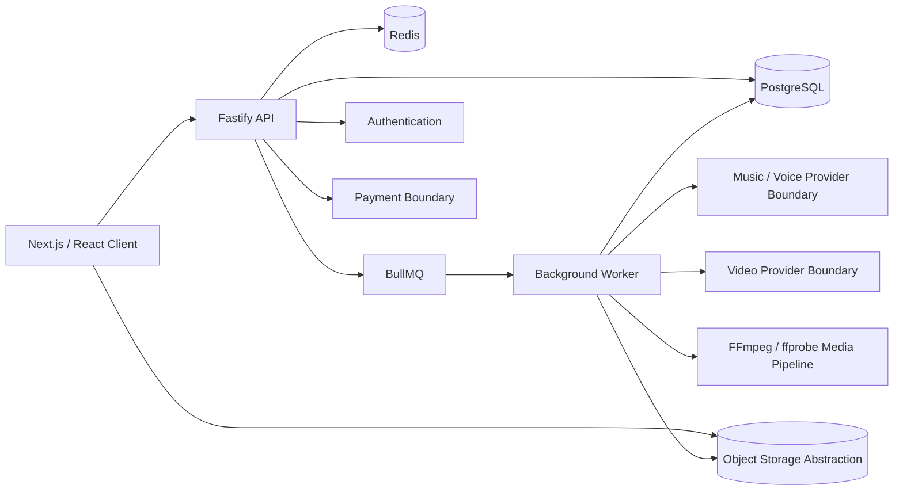

# AI Music

Production-oriented AI music and short-form video SaaS architecture for turning an idea or lyrics into a complete song, optionally using a personal AI voice, then creating a shareable vertical video.

This repository is a **public portfolio / architecture showcase** derived from a separately maintained private production project. It is intentionally not a publishable copy of the production system.

Production provider implementations, proprietary prompts, routing heuristics, exact model configuration, commercial economics, private infrastructure identifiers, operational runbooks, and user data are intentionally excluded.

> **Runnable locally — no production cloud accounts required.**
> The public showcase is designed around local PostgreSQL + Redis, local filesystem storage, development authentication, and deterministic demo providers. Access to production Railway, Neon, object storage, AI-provider, or payment accounts is not required.

## What it demonstrates

AI Music is an AI-powered creation platform. The production product supports:

- prompt or custom-lyrics song creation;
- asynchronous AI generation;
- optional personal-voice workflows;
- generation history and durable job state;
- timeline-based audio editing;
- short-form Share Video / AI Story creation;
- audio and video export;
- credits, payments, authorization, storage, retries, and recovery around external providers.

The public repository focuses on the engineering architecture behind those workflows rather than publishing reconstruction-ready production integrations.

## Quick start

Requirements:

- Node.js 20+
- pnpm 10+
- Docker / Docker Compose

```bash
git clone https://github.com/Demon5611/AI-Music-Showcase.git
cd AI-Music-Showcase

corepack enable
pnpm install
cp .env.example .env

pnpm docker:up
pnpm db:generate
pnpm db:push
pnpm dev
```

Default local endpoints:

```text
Web: http://localhost:3000
API: http://localhost:3001
```

The showcase environment defaults to:

```env
SHOWCASE_MODE=true
AUTH_DEV_MODE=true
STORAGE_DRIVER=local
MUSIC_DEFAULT_PROVIDER=mock
```

No production credentials should be added to this repository.

## Production vs public showcase

| Concern | Private production | Public showcase |
| --- | --- | --- |
| Web / API / Worker | Managed deployment | Local Node processes |
| PostgreSQL | Managed production database | Docker PostgreSQL |
| Redis / queues | Managed Redis | Docker Redis |
| Object storage | Private cloud object storage | Local filesystem |
| Authentication | Production identity provider | Development auth mode |
| Music / voice AI | Private provider adapters | Mock / demo boundary |
| Video AI | Private provider adapters | `VideoProvider` contract + mock |
| Payments | Real hosted payment integration | Disabled / mock behavior |
| Provider routing | Production policy | Intentionally excluded |
| Prompts / model tuning | Private | Intentionally excluded |
| Economics / treasury | Private | Intentionally excluded |

## Core architecture



More detail: [docs/architecture.md](docs/architecture.md).

## Core product flow

```text
Idea / custom lyrics
        ↓
Song generation request
        ↓
Async processing (+ optional personal voice)
        ↓
Durable storage
        ↓
Music editor
        ↓
Track result ───────────────→ Audio export
        ↓
Share Video / AI Story
        ↓
Application scene lifecycle → video provider boundary → composition
        ↓
Validated vertical MP4
```

## Monorepo structure

```text
apps/
  web/          Next.js client
  api/          Fastify HTTP API
  worker/       BullMQ background jobs and media composition
  suno-fake/    Local fake-provider / load-development utility

packages/
  ai-providers/ Public provider contracts + safe/demo implementations
  api-client/   Typed HTTP client
  db/           Prisma schema + durable generation / credit state
  shared/       Zod schemas and cross-service contracts
  storage/      Storage abstraction
  observability/ Health / metrics helpers
  flitt-checkout/ Reduced payment-boundary code retained from showcase snapshot
  tbc-checkout/ Legacy payment adapter / mocks retained from showcase snapshot
  config/       Shared tooling configuration
```

## Technology stack

### Frontend

- Next.js 16
- React 19
- TypeScript
- Tailwind CSS
- TanStack Query
- Zustand
- Clerk-compatible authentication architecture
- next-intl
- Tone.js / Web Audio oriented editor architecture

### Backend

- Fastify
- TypeScript
- Zod
- Prisma + PostgreSQL
- BullMQ + Redis
- FFmpeg + ffprobe
- provider-adapter architecture for external AI / media / payment systems

### Platform

- pnpm workspaces
- Turborepo
- independently deployable Web / API / Worker processes
- local or object-storage-backed media abstraction

## Engineering highlights

- **Provider abstraction** — product logic depends on interfaces instead of vendor SDKs
- **Queue-based long-running workloads** — expensive/slow AI jobs leave the HTTP lifecycle
- **Idempotent side effects** — retries are designed not to duplicate billing or external submissions
- **Provider affinity** — persisted jobs retain their external task identity
- **Append-only credit ledger** — balance derives from transactions
- **Private media ownership** — authorization and signed-access concepts remain separated from UI state
- **Payment state machines** — payment/refund lifecycle is modeled explicitly
- **Reconcilers** — committed external work can recover after crashes or uncertain responses
- **Scene durability** — generated video assets can survive render retries
- **Media validation** — final video output is probed before being marked ready
- **Server-authoritative template gates** — the browser cannot enable disabled generation paths by editing JSON

See [docs/engineering-highlights.md](docs/engineering-highlights.md), [docs/share-video.md](docs/share-video.md), and [docs/security-design.md](docs/security-design.md).

## What works in showcase mode

The public repository is intended to demonstrate the application shape without paid provider access. Depending on the selected local flow, it can exercise:

- Next.js UI and API interaction;
- local development authentication;
- PostgreSQL persistence;
- Redis / BullMQ queues;
- API ↔ Worker separation;
- deterministic provider behavior where a mock is supplied;
- durable job lifecycle concepts;
- local media-storage paths;
- FFmpeg / ffprobe media-pipeline concepts;
- retry / recovery architecture.

The showcase should be treated as an engineering demonstration, not as a substitute deployment for the private production service.

## Intentionally excluded from the public repository

The following are private even when the production product uses them:

- production music / voice / video provider implementations;
- provider-specific payload mappings and undocumented workarounds;
- exact production model selection and tuning;
- proprietary prompts and prompt templates;
- detailed scene-planning / anti-repetition heuristics;
- production provider routing and fallback rules;
- real payment credentials and merchant configuration;
- production infrastructure identifiers and deployment configuration;
- provider account balances, quotas, treasury and admin internals;
- exact COGS, margins, package economics, and commercial decision rules;
- private runbooks, incidents, vendor correspondence, and user data.

The repository may name technologies used in the broader system for portfolio context, but it intentionally does not publish enough provider-specific detail to reproduce the production implementation directly.

## Public/private boundary

The public architecture follows this principle:

```text
PRIVATE PRODUCTION
    real adapters
    proprietary orchestration
    prompts / tuning
    routing / economics
    production operations
          │
          │ sanitized architecture boundary
          ▼
PUBLIC SHOWCASE
    interfaces
    domain lifecycle
    mocks
    reduced worker patterns
    frontend / API architecture
    local infrastructure
    safe documentation
```

See [docs/public-showcase-boundary.md](docs/public-showcase-boundary.md).

## Validation commands

```bash
pnpm typecheck
pnpm lint
pnpm test
pnpm build
```

These commands should be run before merging a sanitized refresh from the private project into the public default branch.

## Security and privacy

- server-side identity is authoritative;
- domain resources require ownership checks;
- secrets belong only in environment variables;
- private media is private by default;
- production external providers are called server-side only;
- public code must use obvious local/demo placeholders;
- production secrets and commercial implementation details must never be copied into this repository.

## Screenshots

Safe product screenshots for this repository live under [docs/assets/](docs/assets/).

Do not add captures containing emails, payment details, internal IDs, provider balances, private admin data, or reconstructable provider configuration.

## Project status

This repository is periodically refreshed from a separately maintained private project through an explicit sanitization step.

The showcase currently represents the AI music architecture plus the later Share Video / AI Story domain and media-pipeline architecture.

## License / usage

Copyright © 2026 Dmitrii Sedov. All rights reserved.

This source is published for portfolio review, technical evaluation, educational inspection, and demonstration purposes. No permission is granted for commercial reuse, redistribution, sublicensing, or derivative commercial products without prior written permission.

See [NOTICE](NOTICE).
