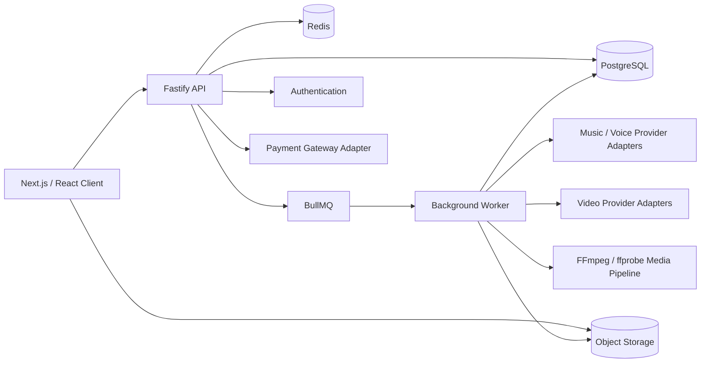

# AI Music

Production-oriented AI music and short-form video SaaS architecture for turning an idea or lyrics into a complete song, optionally using a personal AI voice, then creating a shareable vertical video from the generated track.

This repository is a **public showcase / portfolio** version of a private production project. Commercial credentials, vendor configuration, private infrastructure identifiers, operational runbooks, and proprietary economics have intentionally been removed.

## What it does

AI Music is an AI-powered creation platform. Users can:

- start from a prompt or custom lyrics;
- generate a song through asynchronous AI processing;
- optionally use a personal cloned voice;
- review generation history;
- edit audio in a timeline editor;
- generate a short-form share video / AI Story from a track;
- export audio and video results.

The product orchestrates authentication, credits, durable job lifecycle, media persistence, provider routing, payments, and recovery around external generative-model and payment providers.

## Core product flow

```text
Idea / custom lyrics
        ↓
Song generation request
        ↓
Async AI processing (+ optional personal voice)
        ↓
Object storage persistence
        ↓
Music editor
        ↓
Track result ───────────────→ Audio export
        ↓
Share Video / AI Story
        ↓
Scene planning → video generation → FFmpeg composition
        ↓
Validated vertical MP4
```

## Key capabilities

- Personal-voice onboarding architecture
- Prompt or custom-lyrics generation workflow
- Durable asynchronous music and video generation
- Multi-provider AI orchestration behind stable interfaces
- Credit ledger for billable AI operations
- Hosted payment checkout / refund lifecycle architecture
- Ownership-scoped authorization and signed media access
- Feature-oriented Next.js UI with i18n
- Waveform / timeline editor architecture (Web Audio / Tone.js stack)
- Short-form video generation with scene planning, provider affinity, reconciliation, and final media validation
- Curated AI Story template catalog for product-controlled video styles

## Architecture



More detail: [docs/architecture.md](docs/architecture.md).

## Monorepo structure

```text
apps/
  web/          Next.js client (App Router)
  api/          Fastify HTTP API
  worker/       BullMQ background jobs and media composition
  suno-fake/    Local fake provider for load/dev experiments

packages/
  ai-providers/ Music / voice / video provider abstractions + adapters
  api-client/   Typed HTTP client for web
  db/           Prisma schema + credits ledger + durable generation state
  shared/       Zod schemas, constants, storage keys, cross-service contracts
  storage/      Object storage abstraction
  observability/ Health/metrics helpers
  flitt-checkout/ Hosted payment gateway adapter
  tbc-checkout/ Legacy payment adapter + mocks
  config/       Shared tooling config
```

## Technology stack

### Frontend

- Next.js 16
- React 19
- TypeScript
- Tailwind CSS
- TanStack Query
- Zustand
- Clerk authentication integration
- next-intl internationalization
- Tone.js / Web Audio oriented editor architecture
- waveform playlist / drag-and-drop editor building blocks

### Backend

- Fastify
- TypeScript
- Zod validation
- Prisma + PostgreSQL
- BullMQ + Redis
- FFmpeg + ffprobe for media composition and output validation
- Provider adapters for music / voice / video / payments

### AI / media provider layer

Production code currently includes provider boundaries for:

- music generation and personal-voice workflows;
- CometAPI-backed video generation paths;
- Wan-family image-to-video scenes;
- Sora-based hero-scene experiments behind feature gates;
- BytePlus / Seedance video generation as an explicitly gated provider path;
- deterministic mock providers for local/showcase execution.

Provider credentials, model-account configuration, quotas, exact vendor pricing, and commercial routing rules are intentionally not published here.

### Platform

- pnpm workspaces
- Turborepo
- Object-storage architecture (local or R2-compatible)
- Independently deployable Web / API / Worker processes

## Engineering highlights

- **Provider abstraction** — business logic depends on interfaces, not vendor SDKs
- **Queue-based AI workloads** — long music/video jobs leave the request lifecycle
- **Idempotent spend / enqueue / submit** — retries must not double-charge or double-submit vendor work
- **Provider affinity** — existing jobs and assets keep their persisted provider/task identity
- **Append-only credit ledger** — balance is derived from transactions
- **Signed private media** — short-lived URLs for voice/tracks/renders
- **Payment state machines** — verified callbacks, credit grant, refund jobs
- **Reconcilers** — recover committed work after process crashes or transient provider failures
- **Scene durability** — completed video scenes can be reused during render/recovery instead of regenerating paid media
- **Media validation** — final share videos are probed before being marked ready
- **Template gating** — server-resolved template availability is authoritative, not client-controlled

See [docs/engineering-highlights.md](docs/engineering-highlights.md), [docs/share-video.md](docs/share-video.md), and [docs/security-design.md](docs/security-design.md).

## Reliability and scalability

- Horizontal worker scaling with per-provider concurrency controls
- Shared Redis rate-limit buckets for provider submit pressure
- Durable generation records before external side effects
- Retry / backoff for transient provider and storage failures
- Poll/reconcile recovery after uncertain provider responses
- Re-render paths that reuse durable generated scenes
- ffprobe validation before publishing final video outputs
- Health and metrics endpoints for multi-service operations

## Security and privacy

- Server-side auth identity; no trusted client `userId`
- Ownership checks on domain resources
- Secrets only in environment variables
- Private object storage by default
- Commercial providers are called server-side only
- Showcase repository strips real credentials, infrastructure IDs, vendor quotas, private operational configuration, and exact unit economics

## Local development

Requirements: Node.js 20+, pnpm, Docker (Postgres/Redis optional via compose).

```bash
pnpm install
cp .env.example .env
pnpm docker:up   # if using local Postgres/Redis
pnpm db:generate
pnpm dev
```

Useful scripts:

```bash
pnpm typecheck
pnpm lint
pnpm test
pnpm build
```

## Showcase mode

```env
SHOWCASE_MODE=true
```

When enabled:

- music / voice / video / payment adapters prefer deterministic demo implementations where available;
- no commercial AI provider calls are required;
- no real payment gateway credentials are required;
- API / worker architecture remains intact for local demonstration.

## Screenshots

Safe product screenshots for this public repository live under [docs/assets/](docs/assets/).
Do not add captures that contain emails, payment details, internal IDs, provider balances, or private admin data.

## Project status

This showcase mirrors the architecture of a privately deployed production SaaS and is periodically refreshed from a separately maintained private repository after sanitization.

Current showcase scope includes both the original AI music pipeline and the later Share Video / AI Story architecture.

## Disclaimer

Public showcase version of a private production project.

Commercial credentials, merchant configuration, private infrastructure identifiers, provider-account configuration, exact vendor economics, and production/user data have intentionally been removed or replaced with obvious placeholders.

Third-party foundation models, payment rails, and cloud services are not owned by this repository.

## License / IP

Copyright © 2026. All rights reserved.

This repository is published for portfolio and demonstration purposes.
No license is granted for commercial reuse, redistribution, or derivative commercial products without prior written permission.
