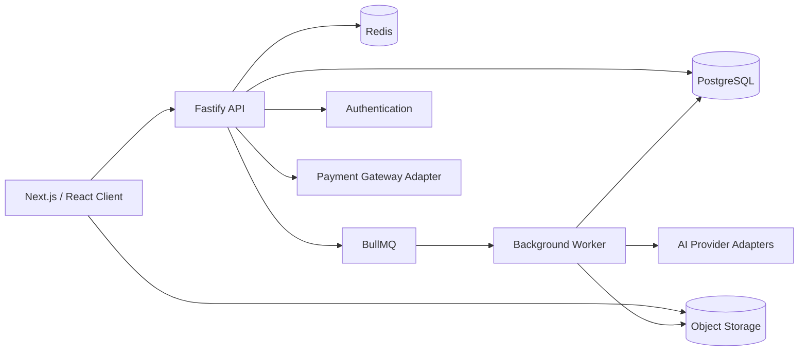

# AI Music

Production-oriented AI music SaaS architecture for turning an idea or lyrics into a
complete song — with optional personal AI voice, asynchronous generation, credit-based
billing, and an integrated audio editor.

This repository is a **public showcase / portfolio** version of a private production
project. Commercial credentials, vendor configuration, and proprietary economics have
intentionally been removed.

## What it does

AI Music is an AI-powered music creation platform. Users can:

- start from a prompt or custom lyrics;
- generate a song through asynchronous AI processing;
- optionally use a personal cloned voice;
- review generation history;
- edit audio in a timeline editor;
- export the result.

The product orchestrates authentication, credits, job lifecycle, media persistence, and
payment verification around external generative-model and payment providers.

## Core product flow

```text
Idea / custom lyrics
        ↓
Song generation request
        ↓
Async AI processing (+ optional personal voice)
        ↓
Object storage persistence
        ↓
Music editor
        ↓
Export
```

## Key capabilities

- Fast personal-voice onboarding architecture
- Prompt or custom-lyrics generation workflow
- Durable asynchronous generation with workers and reconciliation
- Credit ledger for billable AI operations
- Hosted payment checkout / refund lifecycle architecture
- Ownership-scoped authorization and signed media access
- Feature-oriented Next.js UI with i18n
- Waveform / timeline editor architecture (Web Audio / Tone.js stack)

## Architecture



More detail: [docs/architecture.md](docs/architecture.md).

## Monorepo structure

```text
apps/
  web/          Next.js client (App Router)
  api/          Fastify HTTP API
  worker/       BullMQ background jobs
  suno-fake/    Local fake provider for load/dev experiments

packages/
  ai-providers/ Provider abstractions + adapters
  api-client/   Typed HTTP client for web
  db/           Prisma schema + credits ledger
  shared/       Zod schemas, constants, storage keys
  storage/      Object storage abstraction
  observability/ Health/metrics helpers
  flitt-checkout/ Hosted payment gateway adapter
  tbc-checkout/ Legacy payment adapter + mocks
  config/       Shared tooling config
```

## Technology stack

### Frontend

- Next.js 16
- React 19
- TypeScript
- Tailwind CSS
- TanStack Query
- Zustand
- Clerk authentication integration
- next-intl internationalization
- Tone.js / Web Audio oriented editor architecture
- waveform playlist / drag-and-drop editor building blocks

### Backend

- Fastify
- TypeScript
- Zod validation
- Prisma + PostgreSQL
- BullMQ + Redis
- FFmpeg for render/export paths
- Provider adapters for music / voice / payments

### Platform

- pnpm workspaces
- Turborepo
- Object-storage architecture (local or R2-compatible)
- Independently deployable Web / API / Worker processes

## Engineering highlights

- **Provider abstraction** — business logic depends on interfaces, not vendor SDKs
- **Queue-based AI workloads** — long jobs leave the request lifecycle
- **Idempotent spend / enqueue** — retries must not double-charge or double-submit
- **Provider affinity** — existing assets keep their persisted provider
- **Append-only credit ledger** — balance is derived from transactions
- **Signed private media** — short-lived URLs for voice/tracks/renders
- **Payment state machines** — verified callbacks, credit grant, refund jobs
- **Reconcilers** — recover committed work after process crashes

See [docs/engineering-highlights.md](docs/engineering-highlights.md)
and [docs/security-design.md](docs/security-design.md).

## Reliability and scalability

- Horizontal worker scaling with per-provider concurrency controls
- Shared Redis rate-limit buckets for provider submit pressure
- Durable generation records before external side effects
- Retry / backoff for transient provider and storage failures
- Health and metrics endpoints for multi-service operations

## Security and privacy

- Server-side auth identity; no trusted client `userId`
- Ownership checks on domain resources
- Secrets only in environment variables
- Private object storage by default
- Showcase repository strips real credentials and infrastructure IDs

## Local development

Requirements: Node.js 20+, pnpm, Docker (Postgres/Redis optional via compose).

```bash
pnpm install
cp .env.example .env
pnpm docker:up   # if using local Postgres/Redis
pnpm db:generate
pnpm dev
```

Useful scripts:

```bash
pnpm typecheck
pnpm lint
pnpm test
pnpm build
```

## Showcase mode

```env
SHOWCASE_MODE=true
```

When enabled:

- music / voice / payment adapters prefer deterministic demo implementations;
- no commercial AI provider calls are required;
- no real payment gateway credentials are required;
- API / worker architecture remains intact for local demonstration.

Demo adapters live behind the same interfaces as production adapters
(`DemoMusicProvider`, mock generation provider, `DemoPaymentProvider`, etc.).

## Screenshots

Safe product screenshots for this public repository live under
[docs/assets/](docs/assets/).

If screenshots are not checked in yet, placeholders are documented there.
Do not add captures that contain emails, payment details, or internal IDs.

## Project status

This showcase mirrors the architecture of a privately deployed production SaaS.
It is intended for portfolio, interview, and technical review use.

## Disclaimer

Public showcase version of a private production project.

Commercial credentials, merchant configuration, private infrastructure identifiers,
proprietary unit economics, and production/user data have intentionally been removed
or replaced with obvious placeholders.

Third-party foundation models, payment rails, and cloud services are not owned by
this repository.

## License / IP

Copyright © 2026. All rights reserved.

This repository is published for portfolio and demonstration purposes.
No license is granted for commercial reuse, redistribution, or derivative
commercial products without prior written permission.
